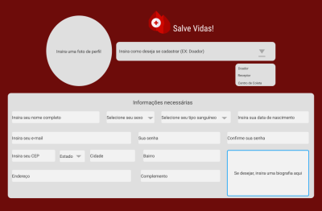
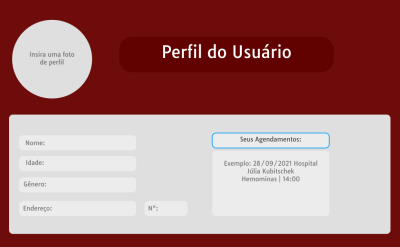
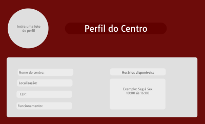
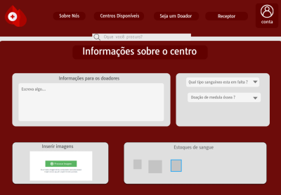
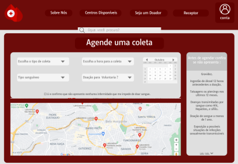
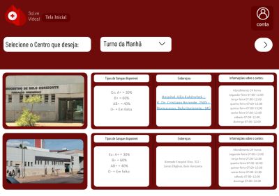
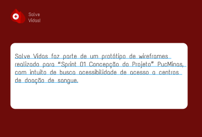

# User flow

# Wireframes
 

 

# Protótipo

>https://www.figma.com/proto/4ffq1mb2qRNtL5FlDXU6kJ/Prot%C3%B3tipo-Doa%C3%A7%C3%A3o-Sangue?node-id=64%3A342&scaling=min-zoom&page-id=64%3A341&starting-point-node-id=64%3A342